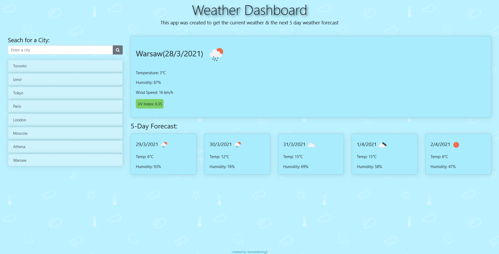

# Weather Dashboard App

### About:
This weather dashboard was created to display the current weather conditions and the upcoming weather forecast of five days. Since, there is the time difference between different cities around the world, the dates are adjusted accordingly. The default city shown is currently `Ottawa` but it could be changed. During this application, I've used the `Open Weather` API to access over 200,000 different city weather information.

### Usage:
* Enter a city name,
* Click the *search* button to access the weather of the city,
* The following current weather information will be displayed:
    *  Temperature
    *  Humidity
    *  Wind Speed
    *  UV Index
* The following 5 day forecast information will be displayed:
    * Temperature
    * Humidity

### Improvements:
>There is actually a lot more information like the *day - night* time & temperature, current weather description that could be added besides the current ones that are being displayed. The following is not a bad example of a `weather forecast` however, it's not the greatest one as well but, for now it should do the work.

### Webpage:
https://kemaldemirgil.github.io/weather-dashboard/

### License:

Copyright © Kemal Demirgil. All rights reserved.
Licensed under the [MIT](https://github.com/kemaldemirgil/weather-dashboard/blob/main/LICENSE) license.
